# Marking Realtime Attendance using Facial Recognition

This repository contains few Jupyter Notebooks and Python scripts related to works being performed for a Realtime Attendance Project.

A presentation had been delivered on the concept of this project with the title ```Projects on Emerging Technological Trends - "Marking Realtime Attendance Using Facial Recognition"``` at GD Goenka University on 28th November 2018. 

Slides from the same have been put beneath.

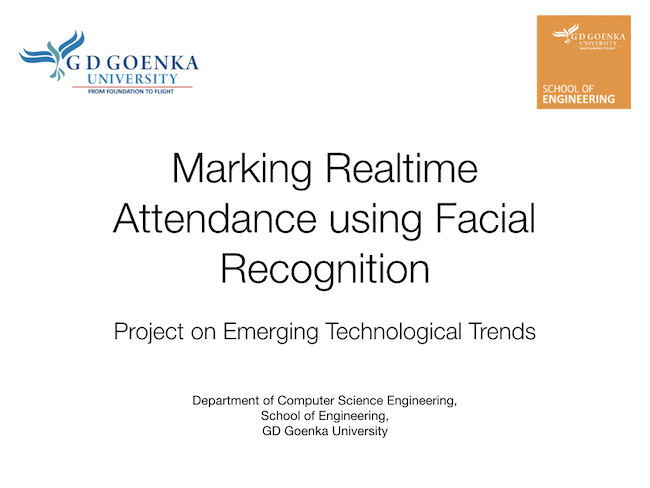

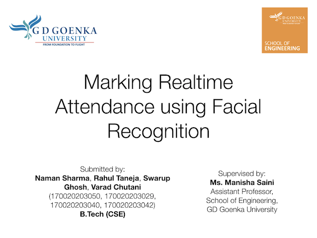

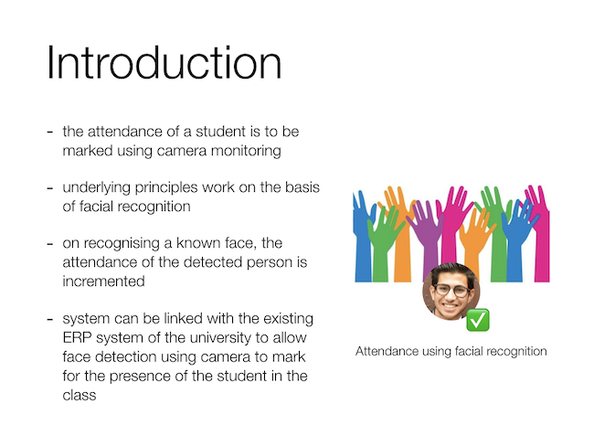

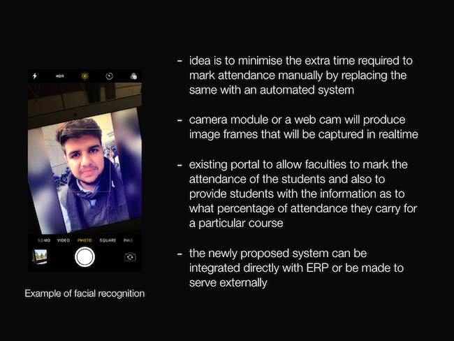


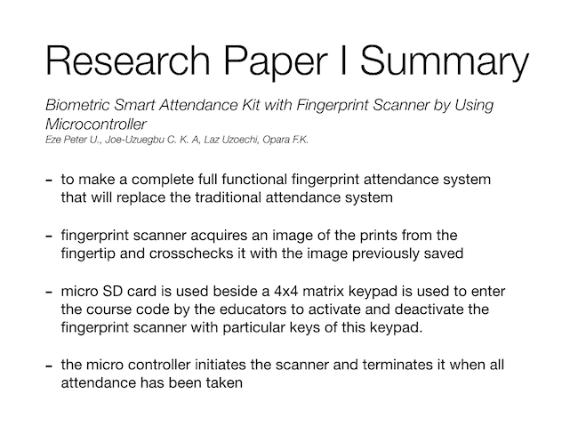

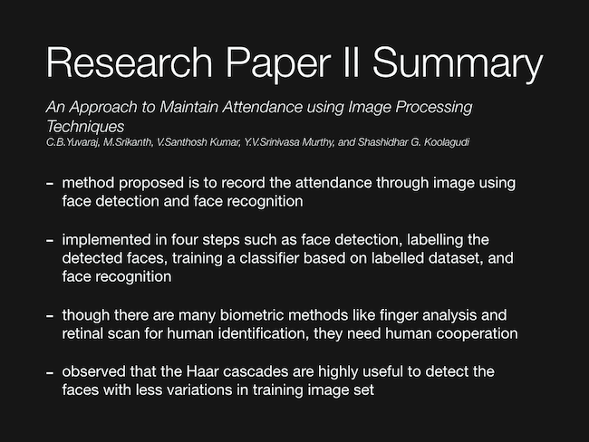

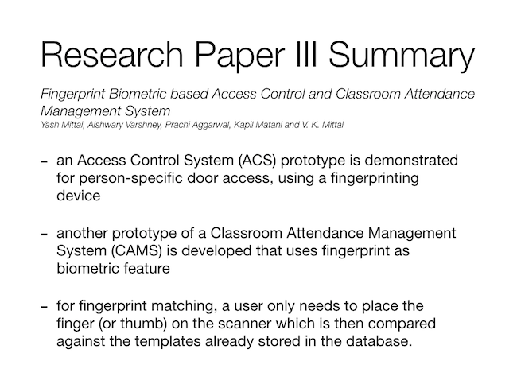


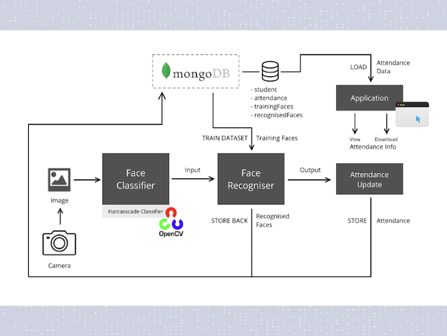

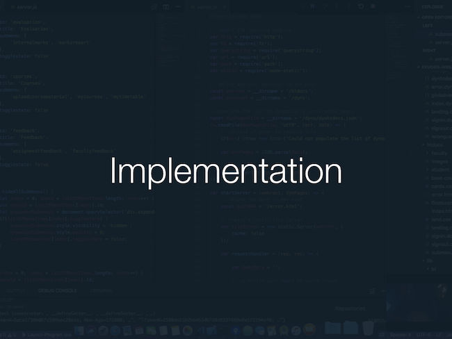

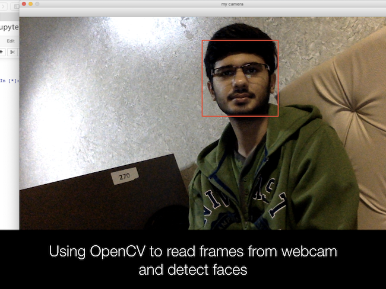

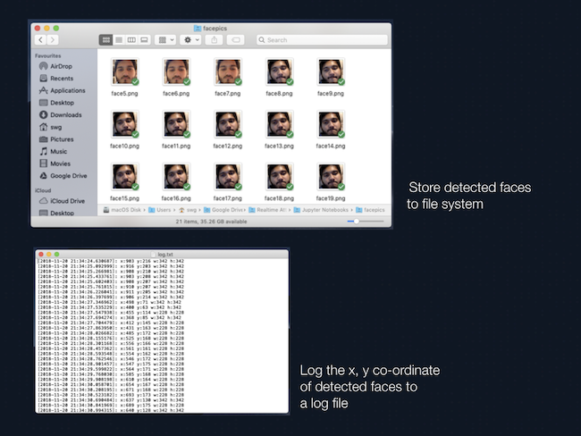

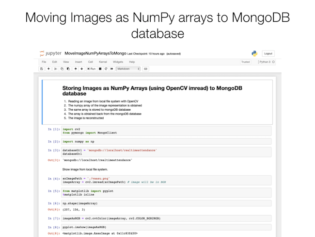


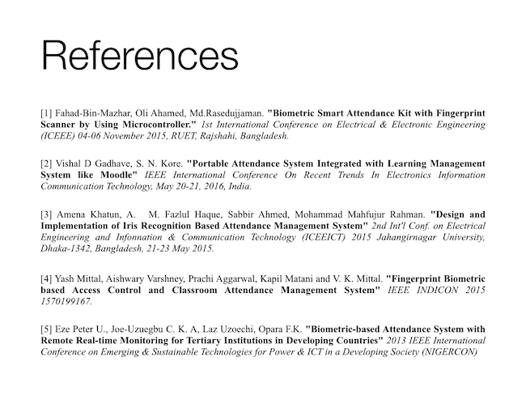

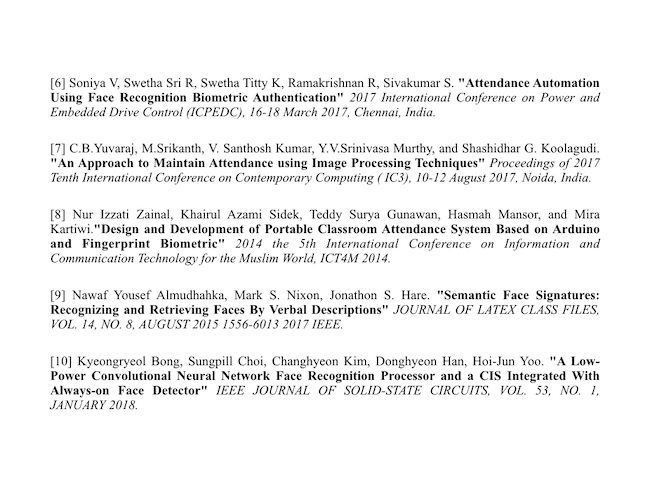
